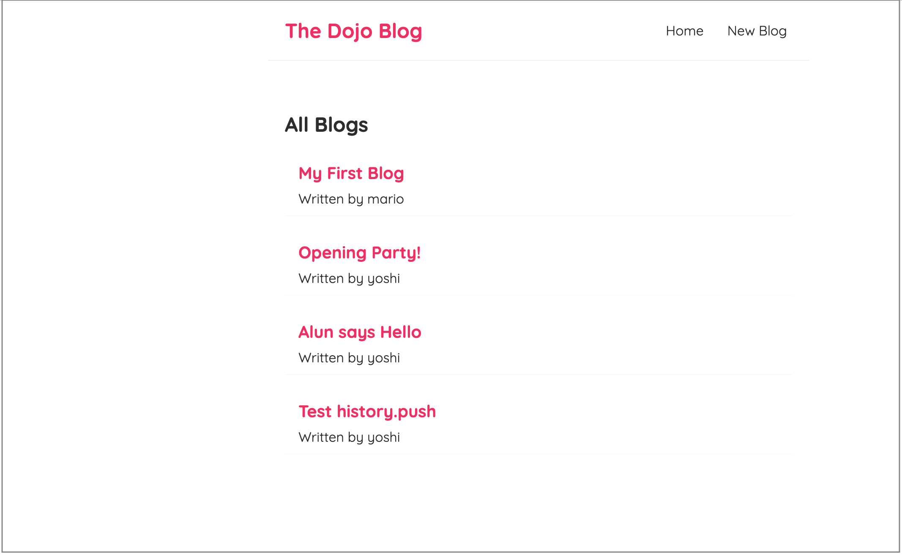

# React Tutorial - Build A Micro-Blog (with json-server)

## Link to demo

[React Micro-Blog demo site](https://alun-react-microblog.netlify.app/)

## Project Description

In this project, we created a micro-blog using React from the ground up.
We used the json-server package to provide a quick pseudo backend.

Areas covered;

- react setup using create-react-app
- JSX templates
- components
- events
- state
- use of hooks
- React Router
- asynchronous code in components

## How to Get Started with this Project

### npm run start

This will run the app at http://localhost:3000

Open up a separate terminal ...

### npx json-server --watch data/db.json --port 8000

This will run the json-server that will give you access to the data at db.json.
This will populate the app with blogs and allow you to add/delete a blog ..

This project was bootstrapped with [Create React App](https://github.com/facebook/create-react-app).

#### Resources

http://localhost:8000/blogs

#### Home

http://localhost:8000/

#### Endpoints Used

